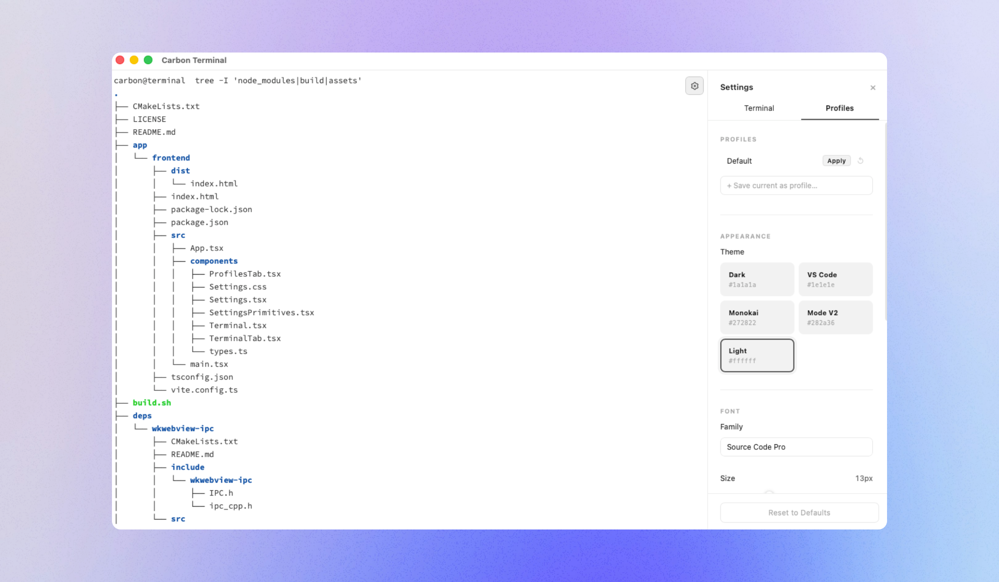

<h1 align="center">
  <a href="https://github.com/carbon-os/terminal">
    
  </a>
  <br>
  Carbon Terminal
  <br>
</h1>

<h4 align="center">A modern, high-performance, general-purpose terminal for macOS, carbonOS, Linux, and Windows</h4>

<p align="center">
  <a href="https://github.com/carbon-os/terminal">
    
  </a>
  <a href="https://github.com/carbon-os/terminal">
    
  </a>
  <br>
  <a href="https://github.com/carbon-os/terminal">
    
  </a>
  <a href="https://github.com/carbon-os/terminal">
    
  </a>
  <a href="https://github.com/carbon-os/terminal">
    
  </a>
  <a href="LICENSE">
    
  </a>
</p>

<br>

---

## Features

- **High performance rendering** — powered by xterm.js with a fully hardware-accelerated canvas backend
- **Native PTY integration** — true pseudoterminal support via `forkpty` on macOS/Linux and ConPTY on Windows, with full resize, signal, and session lifecycle handling
- **Multi-session architecture** — each terminal tab runs an isolated PTY session identified by UUID
- **True color support** — full xterm-256color and 24-bit RGB color support out of the box
- **Clipboard integration** — native read/write clipboard bridge (macOS)
- **Persistent preferences** — profiles and settings stored natively per platform (NSUserDefaults on macOS, XDG config on Linux, %APPDATA% on Windows)
- **Responsive layout** — ResizeObserver-driven fit engine keeps the terminal perfectly sized at all times
- **Minimal chrome** — transparent titlebar, clean dark theme, no clutter
- **Structured IPC bridge** — a binary packet bus with named channels and session IDs connects the native layer and the React frontend, making new features straightforward to add

---

## Terminal UI

<p align="center">
  
</p>

---

## Platform Support

| Platform | Status          | PTY backend  | Shell discovery               | Prefs location                          |
|----------|-----------------|--------------|-------------------------------|-----------------------------------------|
| macOS    | Supported (13+) | `forkpty`    | `$SHELL` → `/bin/zsh`         | `NSUserDefaults`                        |
| carbonOS | Supported       | `forkpty`    | `$SHELL` → `/bin/bash`        | `$XDG_CONFIG_HOME/CarbonTerminal/`      |
| Linux    | Supported       | `forkpty`    | `$SHELL` → `/bin/bash`        | `$XDG_CONFIG_HOME/CarbonTerminal/`      |
| Windows  | Supported       | ConPTY       | `pwsh` → `powershell` → `cmd` | `%APPDATA%\CarbonTerminal\`             |

---

## Architecture

Carbon Terminal is split into two layers that communicate over a structured binary IPC bus:

```
┌─────────────────────────────────────┐
│         Web Frontend (React)        │
│  xterm.js · FitAddon · IPC client   │
└────────────────┬────────────────────┘
                 │  window.__ui  (binary packet bus)
┌────────────────┴────────────────────┐
│      Native Layer (C++ / ObjC++)    │
│  ui::WebView · IPC host · PTY mgr   │
└─────────────────────────────────────┘
```

**Native layer** — written in C++ and Objective-C++ (macOS), plain C++ (Linux/Windows). The window
and webview are managed by [carbon-os/ui](https://github.com/carbon-os/ui), a thin cross-platform
native webview library backed by WKWebView (macOS), WebKit2GTK (Linux), and WebView2 (Windows).
The IPC host multiplexes named channels over a single binary wire. PTY lifecycle (`forkpty` /
ConPTY), preferences, and clipboard are registered as channel handlers on top of it.

**Web frontend** — a React + TypeScript app bundled with Vite. xterm.js handles all terminal
rendering and user input. It communicates with the native layer exclusively through
`window.__ui` — no Node.js, no Electron.

**IPC packet format** — every message is a compact binary frame:

```
[ 0xCA 0xFE | ver | flags | chan_len | sess_len | payload_len (4 LE) | channel | session_id | payload ]
```

This gives every message a typed channel name and a session UUID with zero parsing overhead
on the hot path.

---

## Getting Started

### Prerequisites

**All platforms**
- CMake ≥ 3.22
- Ninja
- Node.js ≥ 18
- A C++23-capable compiler

**macOS**
- macOS 13.0 or later
- Xcode Command Line Tools

**Linux**
- `libwebkit2gtk-4.1-dev` (Debian/Ubuntu) · `webkit2gtk4.1-devel` (Fedora) · `webkit2gtk-4.1` (Arch)
- `libutil` (ships with glibc — provides `forkpty`)

**Windows**
- Windows 10 1903+ (build 18362) — required for ConPTY
- WebView2 runtime (bundled with Windows 10 1903+ / Edge)
- vcpkg with `webview2` package

### Build

```bash
git clone https://github.com/carbon-os/terminal.git
cd terminal
./build.sh          # macOS / Linux
```

```bat
build.bat           # Windows
```

The build script will:
1. Install frontend dependencies and bundle the React app via Vite
2. Configure and compile the native layer with CMake + Ninja
3. **macOS only** — generate the app icon and codesign the `.app` bundle

Output locations:

| Platform | Artifact                   |
|----------|----------------------------|
| macOS    | `build/CarbonTerminal.app` |
| Linux    | `build/CarbonTerminal`     |
| Windows  | `build/CarbonTerminal.exe` |

### Development (hot reload)

Start the Vite dev server before launching the app. Debug builds load from
`http://localhost:5173` instead of the embedded bundle:

```bash
cd app/frontend
npm install
npm run dev
```

Then in a separate terminal:

```bash
./build.sh

# macOS
open build/CarbonTerminal.app

# Linux
./build/CarbonTerminal

# Windows
.\build\CarbonTerminal.exe
```

---

## IPC Channels

All messages are binary packets routed by channel name. The `session_id` field scopes
messages to a specific PTY session (UUID); channels that are session-agnostic leave it empty.

| Channel                | Direction         | Payload                         | Description                       |
|------------------------|-------------------|---------------------------------|-----------------------------------|
| `pty.spawn`            | Frontend → Native | JSON `{ "cols": N, "rows": N }` | Spawn a new PTY session           |
| `pty.in`               | Frontend → Native | Raw keystroke bytes             | Stdin to the shell                |
| `pty.resize`           | Frontend → Native | JSON `{ "cols": N, "rows": N }` | Notify shell of terminal resize   |
| `pty.kill`             | Frontend → Native | _(empty)_                       | Terminate a PTY session           |
| `pty.out`              | Native → Frontend | Raw bytes                       | Shell stdout stream               |
| `pty.exit`             | Native → Frontend | Exit code as UTF-8 string       | Session ended notification        |
| `clipboard.write`      | Frontend → Native | UTF-8 text                      | Write text to system clipboard    |
| `clipboard.read`       | Frontend → Native | _(empty)_                       | Request clipboard contents        |
| `clipboard.data`       | Native → Frontend | UTF-8 text                      | Clipboard read response           |
| `prefs.profiles.load`  | Frontend → Native | _(empty)_                       | Request saved profiles            |
| `prefs.profiles.data`  | Native → Frontend | JSON array                      | Profiles payload                  |
| `prefs.profiles.save`  | Frontend → Native | JSON array                      | Persist profiles                  |
| `prefs.settings.load`  | Frontend → Native | _(empty)_                       | Request saved settings            |
| `prefs.settings.data`  | Native → Frontend | JSON object                     | Settings payload                  |
| `prefs.settings.save`  | Frontend → Native | JSON object                     | Persist settings                  |

---

## Contributing

Pull requests are welcome. For large changes please open an issue first to discuss
what you would like to change.

---

## License

Apache License